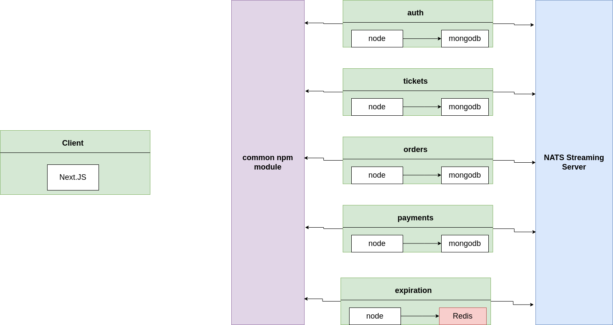
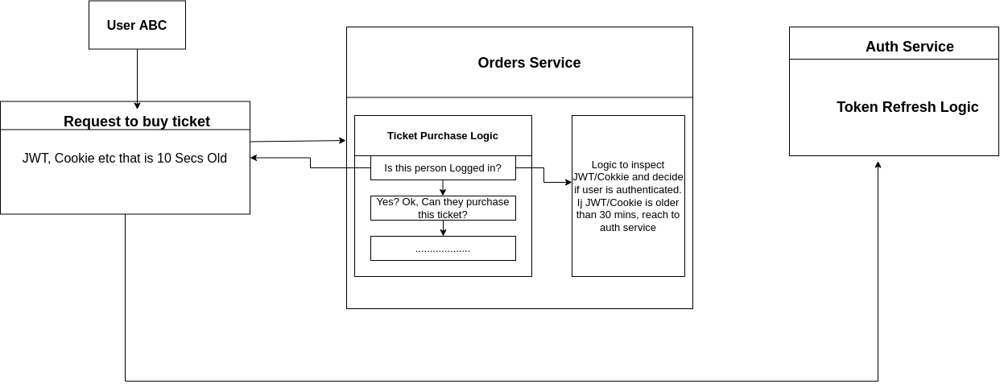

# Microservices Ticketing App
## How it works
-   Users can list a ticket for an event(concert, sports) for sale.
-   Other users can purchase this ticket
-   Any user   can list tickets for sale and purchase tickets
-   When a user attempts to purchase a ticket, the ticket is 'locked' for 15 minutes. The user has 15 minutes to enter their payment info
-   While locked, no other user can purchase the ticket. After 15 minutes, the ticket should unlock
-   Ticket prices can be edited if they are not locked.

## Services
1. **auth** Everything related to user signup/signin/signout
2. **tickets** Ticket creation/editing. Knows whether a ticket can be updated.
3. **orders** Order creation/editing.
4. **expiration** Watches for orders to be created, cancels them after 15 mins
5. **payments** Handles credit card payments. Cancels orders if payments fail, completes orders if payment succeeds.

## Architecture

## Authentication Strategy
### Requirements for the Auth System
1. Must be able to tell details about a user
2. Must be able to ahnd;e authorization info
3. Must have a built-in, tamper-resistant way to expire or invalidate itself
4. Must be easily understood between different languages
5. Must not require some kind of backing data store on the server

### Auth Flow Example
